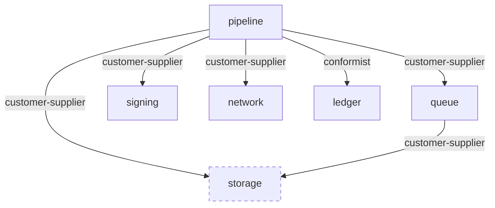

# Context map

<!-- GENERATED from manifest Relationships sections (manual derivation by cairn-charter 2026-08-23; generator tooling pending — regenerate whenever a manifest's Relationships change). DO NOT EDIT BY HAND. -->

| Consumer | Relationship | Supplier | Declared in |
|---|---|---|---|
| `queue` | `customer-supplier` | `storage` | `src/queue/MODULE.md` |
| `pipeline` | `customer-supplier` | `storage` | `src/pipeline/MODULE.md` |
| `pipeline` | `customer-supplier` | `queue` | `src/pipeline/MODULE.md` |
| `pipeline` | `customer-supplier` | `signing` | `src/pipeline/MODULE.md` |
| `pipeline` | `customer-supplier` | `network` | `src/pipeline/MODULE.md` |
| `pipeline` | `conformist` | `ledger` (u5c vocabulary) | `src/pipeline/MODULE.md` |
| `storage` | `open-host` (supplier-side declaration) | — | `src/storage/MODULE.md` |

Modules without manifests yet (`ledger`, `network`, `signing`, `server`, `validation`) appear only as referenced suppliers; their consumer-side declarations are pending their own charter.
