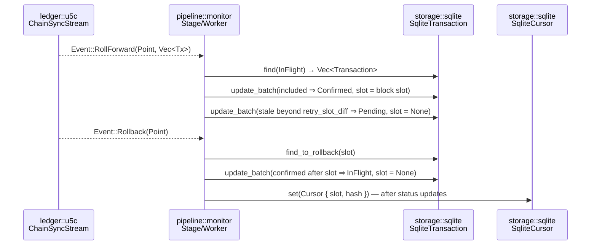

+++
schema = "cairn/v0"
flow = "confirm"
short = "CONFIRM"
participants = ["pipeline", "ledger/u5c", "storage"]
+++

# Flow — confirm/rollback (monitor)

<!-- Curated flow doc, drafted 2026-08-23 by cairn-survey @ fdec4da; diagram traced from src/pipeline/monitor.rs. -->

The `monitor` gasket stage follows the chain through the u5c `ChainSyncStream` and drives the tail of the tx lifecycle: `InFlight → Confirmed` on inclusion, `InFlight → Pending` on retry timeout, and un-confirmation on rollback. The chain cursor is persisted after each event for crash recovery.

**⚑ Flow-contract nominee (SPEC §12):** this flow's defining invariants are temporal and multi-module (crash recovery, rollback correctness, retry/confirm races). It is the survey's nomination for the first Quint model, if/when one is written.

## Invariants

- **INV-CONFIRM-001** `[unverified]` — A transaction is `Confirmed` only when observed in a rolled-forward block; its `slot` then records the confirmation slot.
- **INV-CONFIRM-002** `[unverified]` — An `InFlight` transaction not confirmed within `retry_slot_diff` slots returns to `Pending` (and will be re-broadcast by fanout), so no transaction is stranded `InFlight` forever while the chain advances.
- **INV-CONFIRM-003** `[unverified]` — On rollback to slot S, transactions confirmed after S revert to `InFlight` and are eligible for re-confirmation; no transaction remains `Confirmed` at a slot beyond the new tip.
- **INV-CONFIRM-004** `[unverified]` — The cursor is persisted only after the corresponding status updates, so a crash between the two replays the event (at-least-once) rather than skipping it.
