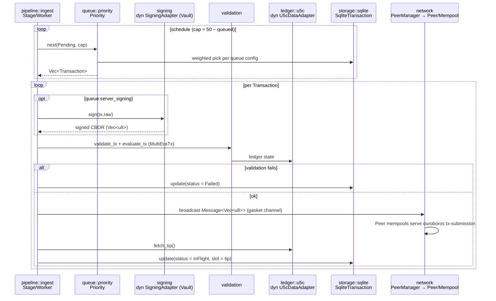

+++
schema = "cairn/v0"
flow = "fanout"
short = "FANOUT"
participants = ["pipeline", "queue", "signing", "validation", "ledger/u5c", "network", "storage"]
+++

# Flow — fanout (queue → peers)

<!-- Curated flow doc, drafted 2026-08-23 by cairn-survey @ fdec4da; diagram traced from src/pipeline/ingest.rs, src/pipeline/mod.rs, src/network/. -->

The `ingest` gasket stage drains `Pending` transactions by queue priority, optionally signs them server-side, re-validates, and broadcasts them to all connected Ouroboros tx-submission peers. Broadcast marks the tx `InFlight` stamped with the tip slot.

## Invariants

- **INV-FANOUT-001** `[unverified]` — A transaction reaches `InFlight` only after a successful broadcast, and its `slot` is set to the tip at broadcast time (this is what `monitor`'s retry window keys off).
- **INV-FANOUT-002** `[unverified]` — A transaction on a `server_signing` queue is never broadcast unsigned; absence of a signing adapter causes retry, not passthrough.
- **INV-FANOUT-003** `[unverified]` — In-flight output never exceeds the channel cap (50); scheduling backs off rather than dropping.
