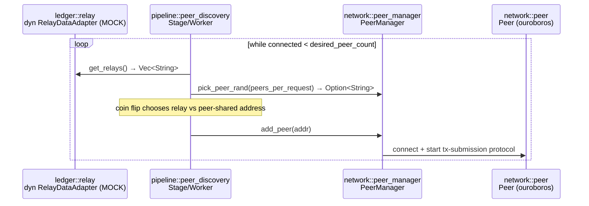

+++
schema = "cairn/v0"
flow = "peer-discovery"
short = "DISCOVERY"
participants = ["pipeline", "ledger/relay", "network"]
+++

# Flow — peer discovery

<!-- Curated flow doc, drafted 2026-08-23 by cairn-survey @ fdec4da; diagram traced from src/pipeline/peer_discovery/mod.rs. -->

The `peer_discovery` gasket stage tops up the peer pool toward `desired_peer_count`, choosing 50/50 between on-chain relays (via `RelayDataAdapter` — **currently the mock implementation**, an acknowledged gap: see `src/pipeline/mod.rs:33` and [decision 0003](../decisions/0003-real-relay-source-for-peer-discovery.md)) and peers learned from existing peers' peer-sharing.

## Invariants

- **INV-DISCOVERY-001** `[unverified]` — The pool converges toward `desired_peer_count` and does not add peers beyond outstanding need (`peer_discovery_queue` bounds in-flight additions).
