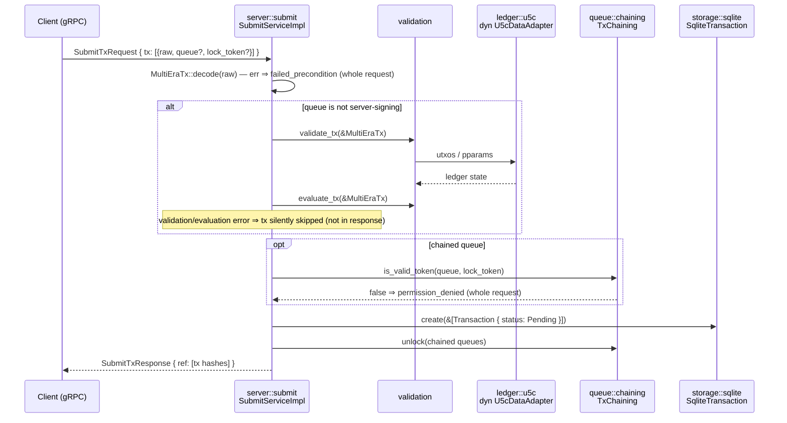

+++
schema = "cairn/v0"
flow = "submit"
short = "SUBMIT"
participants = ["server", "validation", "ledger/u5c", "queue", "storage"]
+++

# Flow — submit (gRPC → queued)

<!-- Curated flow doc, drafted 2026-08-23 by cairn-survey @ fdec4da; diagram traced from src/server/submit.rs. -->

A client submits one or more raw transactions over gRPC. Each is decoded, optionally validated against ledger state, checked against queue lock tokens, and persisted as `Pending`.

## Invariants

- **INV-SUBMIT-001** `[unverified]` — A transaction accepted into storage always enters with status `Pending` and the queue name resolved (unknown queue falls back to the default queue).
- **INV-SUBMIT-002** `[unverified]` — A submission to a chained queue is persisted only if its lock token is valid; the queue is unlocked only after the batch is persisted.
- **INV-SUBMIT-003** `[unverified]` — Every hash in `SubmitTxResponse.ref` corresponds to a transaction that was persisted. *(Note the converse is currently false by design: txs failing validation are skipped silently and produce no error — an intentional-or-not behavior worth a human decision.)*
