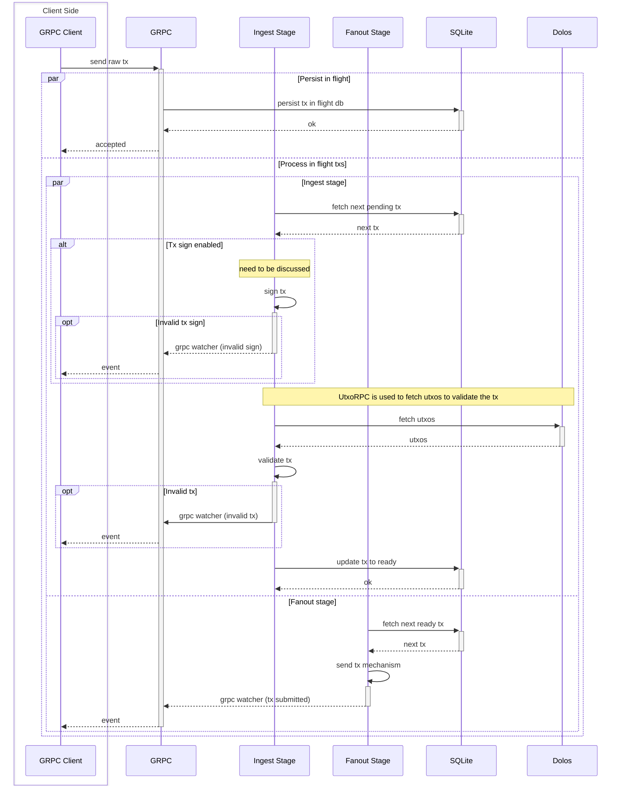
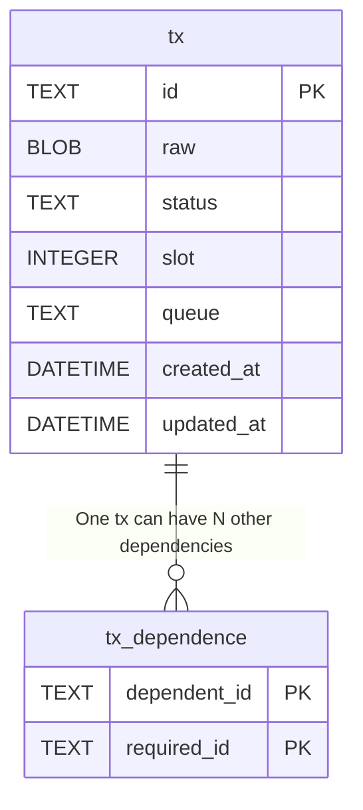

Boros runs two threads, where one is the pipeline to process the states of transactions, and the other one is the GRPC server to receive requests. The GRPC makes a basic validation only to check if the transactions are valid and save them as pending in the DB. Each stage in the pipeline consumes the transactions in the DB based on the status of the transaction, so if the Boros process shuts down, it can be started again without losing the state. Furthermore, the pipeline has a policy of attempts, so if there's an error, the stage is retried based on the policy.

Take a look at the [architectural decision record](./design/adrs)

## Sequence Flow

Sequence diagram to describe how Boros process the requests and the state of the transactions.

## Schema

As Boros allows one transaction just be executed after another transaction, the schema supports transaction dependencies.

