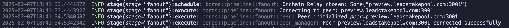

# Boros Catalyst Milestone 2: Test Report

This document outlines the detailed analysis of the tests conducted on the **Fanout Mechanism** component of the Boros project. Each test case is thoroughly examined, covering the objectives, execution details, and expected outcomes. Please refer to the attached screenshots for detailed evidence.

---

### 1. Transaction Propagation

**Test Objective:**  
Verify that the fanout mechanism propagates transactions to peers successfully.

**Details:**
- Peers are provided via configuration and are initialized.
- The `Fanout Stage` periodically schedules a `transaction submission` task. This process ensures that the system keeps listening for incoming transactions to properly propagate them.
- The connected peers will concurrently wait for the server's next request.
- When a transaction is submitted, it will be propagated each to the connected peers.
- The logs below show the propagation process, where transactions are processed first, followed by acknowledgment upon successful transmission.

**Screenshot:**  

---

### 2. Multi-Peer Connectivity

**Test Objective:**  
Verify that the fanout mechanism connects to multiple peers simultaneously using node-to-node protocols.

**Details:**
- At the start, the `PeerManager` is initialized with a predefined set of peer addresses provided via configuration.
- The `PeerManager` creates a connection to each of these peers asynchronously, ensuring the system can manage multiple connections at once.
- Peer discovery via `peersharing mini-protocol` is also checked for every connected peer, ensuring a dynamic way of maintaining multiple concurrent connectivity.

**Screenshot:**  

---

### 3. Static Topology Configuration

**Test Objective:**  
Verify that a static topology can be provided via configuration and is honored by the fanout mechanism.

**Details:**
- A static list of peer addresses is provided in the configuration file and loaded at bootstrap.
- The `PeerManager` is initialized with these addresses, ensuring that only these specified peers are used for communication initially.
- The `PeerManager` verifies that the specified peers are available and initializes them accordingly.
- The peer connections are logged for debugging and traceability.

**Screenshot:**  

---

### 4. Dynamic Topology via On-Chain Relay Data

**Test Objective:**  
Verify that a dynamic topology can be constructed automatically using on-chain relay data from pool certificates.

**Details:**
- The fanout stage `Worker` fetches relay data using `relay_adapter.get_relays()` method of a generic RelayDataAdapater trait, to gather on-chain relay information that can be used for peer discovery and network topology creation.
- The `Worker` uses the fetched relay data to dynamically add new peers to the system. It selects `random relay data` from the pool and attempts to connect to those peers.
- The system checks whether the topology updates correctly by adding peers based on the dynamically retrieved on-chain relay data.
- If new peers are found, they are added to the current connected peers.

**Screenshot:**  

---

### 5. Dynamic Topology via Peer Sharing

**Test Objective:**  
Verify that a dynamic topology can be constructed via p2p networking using the peer sharing mini-protocol.

**Details:**
- The `Fanout Stage` periodically schedules a peer discovery task. This process ensures that the system keeps discovering new peers over time to expand the network.
- During operation, a `randomly chosen connected peer with peersharing enabled` performs peer discovery. This peer will have its own discovered peers, and one of these discovered peers will be chosen `randomly` and will be used to try for connection.
- A configuration to limit connected peers is also provided. If the total connected peers exceeds this limit, the `WorkerSchedule` will idle.
- If a peer discovery fails or a peer cannot be reached, the system logs the failure and retries the discovery process, demonstrating resilience in the network discovery process.
- The discovery and connection processes are logged, allowing for easy monitoring of the system’s dynamic topology construction.
- The logs also capture the errors encountered during the discovery process and provide insights into the system’s retry behavior.

**Screenshot:**  

---

## Conclusion

All acceptance criteria for the fanout mechanism have been met with successful test outcomes in the following areas:

| Test Case                                          | Outcome                                  |
| -------------------------------------------------- | ---------------------------------------- |
| **Transaction Propagation**                        | Transactions are reliably propagated to all connected peers. |
| **Multi-Peer Connectivity**                        | The system effectively maintains multiple simultaneous connections using node-to-node protocols. |
| **Static Topology Configuration**                  | The Fanout Mechanism adheres to the static topology specified in the configuration file at bootstrap. |
| **Dynamic Topology via On-Chain Relay Data**       | On-chain data is used to dynamically update and optimize the peer topology. |
| **Dynamic Topology via Peer Sharing**              | The peer-sharing mini-protocol ensures the network expands dynamically and efficiently.

The attached screenshots serve as evidence for each test case, confirming that the fanout mechanism is robust and performs as expected in all tested scenarios.
